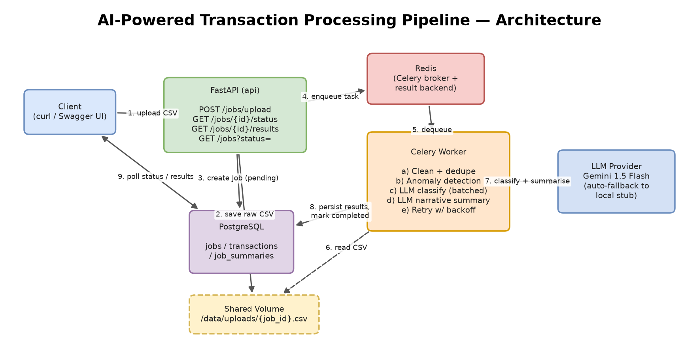

# AI-Powered Transaction Processing Pipeline

A backend service that ingests a raw, messy financial-transactions CSV, processes
it **asynchronously through a job queue**, uses an **LLM to classify transactions
and flag anomalies**, and exposes the structured results via a **polling API**.

> Built for the Backend + DevOps assignment. The entire stack — API, worker,
> Redis, PostgreSQL — boots with a single `docker compose up`. **No manual setup
> steps, and no API key required** (it ships with an automatic offline LLM
> fallback so it runs anywhere out of the box).

---

## Tech Stack

| Concern            | Choice                                              |
| ------------------ | --------------------------------------------------- |
| API framework      | **FastAPI** (async, auto OpenAPI docs)              |
| Database           | **PostgreSQL 16**                                   |
| Job queue          | **Celery + Redis**                                  |
| LLM                | **Gemini 1.5 Flash** (free tier) → **auto-fallback** to a deterministic local classifier |
| Containerisation   | **Docker + Docker Compose**                         |
| Data processing    | pandas, python-dateutil                             |
| Resilience         | tenacity (exponential-backoff retries)              |

---

## Architecture



> The editable diagram lives at [`docs/architecture.drawio`](docs/architecture.drawio)
> (open at [draw.io](https://app.diagrams.net)). Export a PNG to `docs/architecture.png`
> if you want it inline above.

```
            ┌────────┐   upload CSV    ┌──────────────┐
            │ Client │ ──────────────► │   FastAPI    │
            └────────┘                 │    (api)     │
                 ▲                     └──────┬───────┘
                 │ poll status/results        │ create Job(pending) + save CSV
                 │                            │ enqueue task
                 │                     ┌──────▼───────┐
                 │                     │    Redis     │  (broker + result backend)
                 │                     └──────┬───────┘
                 │                            │ dequeue
            ┌────┴─────┐  persist     ┌──────▼───────┐  classify/summarise  ┌──────────┐
            │ Postgres │ ◄─────────── │ Celery Worker│ ───────────────────► │   LLM    │
            └──────────┘   results    │  (pipeline)  │                      │ Gemini / │
                                      └──────────────┘                      │  stub    │
                                                                            └──────────┘
```

### Request lifecycle (single upload)

1. `POST /jobs/upload` → API validates the file, writes a `Job(status=pending)`
   row, persists the raw CSV to a **shared volume** (`/data/uploads/{job_id}.csv`),
   enqueues a Celery task, and returns the `job_id` **immediately** (HTTP 202).
2. The **worker** dequeues the task, flips the job to `processing`, and runs the
   pipeline (clean → anomaly → classify → summarise).
3. Cleaned `Transaction` rows + a `JobSummary` are persisted; the job is marked
   `completed` (or `failed` with an `error_message`).
4. The client polls `GET /jobs/{job_id}/status` until `completed`, then fetches
   `GET /jobs/{job_id}/results`.

---

## Project Structure

```
.
├── app/
│   ├── main.py            # FastAPI app + lifespan (creates tables on boot)
│   ├── config.py          # Env-driven settings (pydantic-settings)
│   ├── database.py        # SQLAlchemy engine / session / get_db dependency
│   ├── models.py          # ORM: Job, Transaction, JobSummary
│   ├── schemas.py         # Pydantic request/response models
│   ├── celery_app.py      # Celery instance (shared by api + worker)
│   ├── api/
│   │   └── jobs.py        # All /jobs endpoints
│   ├── pipeline/
│   │   ├── cleaning.py    # (a) normalise + dedupe
│   │   ├── anomaly.py     # (b) outliers + currency anomalies
│   │   └── tasks.py       # Celery task orchestrating the full pipeline
│   └── llm/
│       └── client.py      # (c)(d)(e) batched classify + summary, retry, fallback
├── tests/                 # pytest unit tests (cleaning, anomaly, llm stub)
├── sample_data/transactions.csv
├── docs/architecture.drawio
├── docker-compose.yml
├── Dockerfile
├── requirements.txt
└── .env.example
```

**Why this layout?** The HTTP layer (`api/`), the domain pipeline (`pipeline/`),
and the external LLM integration (`llm/`) are kept separate so each is unit-testable
in isolation. The pure functions in `cleaning.py` / `anomaly.py` need no database or
network, which is exactly what the tests exercise.

---

## Quick Start

### Prerequisites
- Docker + Docker Compose (Docker Desktop on Windows/Mac).

### Run

```bash
git clone <your-repo-url>
cd <repo>
docker compose up --build
```

That's it. Wait for the `api` container to report healthy, then open the
interactive docs at **http://localhost:8000/docs**.

> **LLM key is optional.** With no `GEMINI_API_KEY`, the pipeline uses a built-in
> deterministic classifier so everything works offline. To use real Gemini,
> copy `.env.example` → `.env` and set `GEMINI_API_KEY` (free key from
> <https://aistudio.google.com/app/apikey>), then `docker compose up`.

---

## API Endpoints & Example `curl` Requests

### 1. Upload a CSV → returns `job_id` immediately

```bash
curl -s -X POST http://localhost:8000/jobs/upload \
  -F "file=@sample_data/transactions.csv"
```

```json
{
  "job_id": "3f2c8b1a-...-...",
  "status": "pending",
  "filename": "transactions.csv",
  "message": "Job accepted and queued for processing."
}
```

### 2. Poll job status (includes a summary once completed)

```bash
curl -s http://localhost:8000/jobs/<job_id>/status
```

```json
{
  "job_id": "3f2c8b1a-...",
  "status": "completed",
  "filename": "transactions.csv",
  "row_count_raw": 95,
  "row_count_clean": 85,
  "created_at": "2026-06-12T12:00:00Z",
  "completed_at": "2026-06-12T12:00:03Z",
  "summary": {
    "total_spend_inr": 512345.67,
    "total_spend_usd": 98765.43,
    "top_merchants": [{"merchant": "Amazon", "total_amount": 120345.5}],
    "anomaly_count": 10,
    "narrative": "Across 85 transactions, spending totalled ...",
    "risk_level": "medium"
  }
}
```

### 3. Full structured results

```bash
curl -s http://localhost:8000/jobs/<job_id>/results
```

Returns: `transactions` (cleaned), `anomalies` (flagged subset with reasons),
`category_breakdown` (per-category counts + spend), and `summary`.

### 4. List jobs (with optional status filter)

```bash
curl -s http://localhost:8000/jobs
curl -s "http://localhost:8000/jobs?status=completed"
```

### Convenience: one-shot demo

```bash
JOB=$(curl -s -X POST http://localhost:8000/jobs/upload \
  -F "file=@sample_data/transactions.csv" | python -c "import sys,json;print(json.load(sys.stdin)['job_id'])")
sleep 5
curl -s http://localhost:8000/jobs/$JOB/results | python -m json.tool
```

---

## The Processing Pipeline (what the worker does)

| Step | Module | Behaviour |
| ---- | ------ | --------- |
| **a) Clean** | `pipeline/cleaning.py` | Dates → ISO 8601 (handles `DD-MM-YYYY` and `YYYY/MM/DD`); strip `$`/separators from amounts; uppercase status; blank category → `Uncategorised`; **drop exact duplicate rows**. |
| **b) Anomaly** | `pipeline/anomaly.py` | Flag amount > **3× the account's median** (statistical outlier); flag **USD on a domestic-only merchant** (Swiggy/Ola/IRCTC/…). Both reasons can stack on one row. |
| **c) Classify** | `llm/client.py` | For rows missing a category, call the LLM in **batches** (never one call per row), constrained to the 8 allowed categories. |
| **d) Summary** | `llm/client.py` | A **single** LLM call produces the narrative + `risk_level`; numeric aggregates (spend by currency, top-3 merchants, anomaly count) are computed deterministically and stored as structured `JobSummary`. |
| **e) Retry** | `llm/client.py` | LLM calls retry up to **3× with exponential backoff**. If a batch still fails it is marked `llm_failed` and the job **continues** — the LLM never fails the whole job. |

---

## Data Model

- **Job** — `id, filename, status, row_count_raw, row_count_clean, created_at, completed_at, error_message`
- **Transaction** — `id, job_id, txn_id, date, merchant, amount, currency, status, category, account_id, notes, is_anomaly, anomaly_reason, llm_category, llm_raw_response, llm_failed`
- **JobSummary** — `id, job_id, total_spend_inr, total_spend_usd, top_merchants (JSONB), anomaly_count, narrative, risk_level, llm_failed`

Tables are created automatically on API startup (`Base.metadata.create_all`) — no
migration command to run.

---

## Tests

Pure-logic units (cleaning, anomaly detection, LLM stub) run with no Docker/DB:

```bash
python -m venv .venv && .venv/Scripts/activate      # (Windows; use source .venv/bin/activate on *nix)
pip install -r requirements.txt
pytest -q
```

```
14 passed
```

---

## Design Notes & Scaling

See the 3-minute video for the full walkthrough. In short:

- **Where it breaks at 100× traffic:** the synchronous `await file.read()` loads
  the whole upload into memory; pandas loads each CSV fully in the worker; a single
  Celery task processes a file end-to-end; the DB connection pool and a single
  worker replica become the throughput ceiling.
- **Next iteration:** stream uploads to object storage (S3) and pass a key instead
  of the bytes; chunk the CSV and fan out per-batch sub-tasks (Celery `chord`);
  bulk-insert via `COPY`; autoscale workers per queue; add a managed Postgres with
  PgBouncer; cache idempotent LLM classifications. Trade-off: more moving parts and
  eventual-consistency complexity in exchange for horizontal scale.

---

## Configuration Reference

All values have working defaults (see `app/config.py`). Override via env / `.env`:

| Variable | Default | Purpose |
| -------- | ------- | ------- |
| `DATABASE_URL` | `postgresql+psycopg2://postgres:postgres@db:5432/transactions` | Postgres DSN |
| `CELERY_BROKER_URL` | `redis://redis:6379/0` | Celery broker |
| `CELERY_RESULT_BACKEND` | `redis://redis:6379/1` | Celery results |
| `LLM_PROVIDER` | `auto` | `auto` \| `gemini` \| `stub` |
| `GEMINI_API_KEY` | _(empty)_ | Free-tier Gemini key (optional) |
| `LLM_MODEL` | `gemini-1.5-flash` | Gemini model id |
| `LLM_BATCH_SIZE` | `20` | Transactions per classification call |
```
